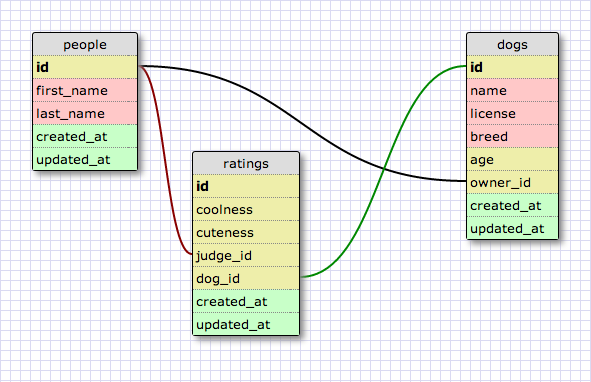

# Active Record Intro: Editing Tables

## Summary



*Figure 1.*  Database schema for this challenge.

In this challenge, we're going to make some small adjustments to an already existing database.  We'll need to drop a column, add a column, and rename a column.  We'll be writing Active Record migrations to make these changes.  

When we write Active Record migrations to create a table, we rely on the `#create_table` method inherited from the `ActiveRecord::Migration` class.  When we want to make changes to existing tables, we'll also rely on inheriting behaviors from this class; we just need to explore the api to see [which methods are available][RailsGuides Using the Change Method].

This challenge provides us with migrations that create the three tables:  people, ratings, and dogs.  However, they create the tables based on out-of-date expectations.  Our updated schema design—as seen in Figure 1—has three changes from the previous design:

- On the `dogs` table, the column `weight` has been removed.
- On the `dogs` table, the column `breed` has been added.
- On the `ratings` table, the column `rater_id` is renamed to `judge_id`.

```ruby
class RemoveWeightFromDogs < ActiveRecord::Migration
  def change
    remove_column :dogs, :weight
  end
end
```
*Figure 2.*  Migration for removing the weight column from the dogs table.

In this challenge, we'll write a series of new migration files to bring our database up-to-date with our new design.  It is advisable to write one migration for each change that we want to make to our database.  For example, we might create one migration to remove the weight column from the dogs table (see Figure 2).


## Releases
### Release 0: Set up Database with Old Schema
```
$ bundle install
$ bundle exec rake db:create
$ bundle exec rake db:migrate
```
*Figure 3*.  Setting up the database with the old schema.

To begin this challenge, we first need to set up a database with the old schema (see Figure 3).	Once the database has been created and the provided migrations have been run, we can run the tests.  The output should reveal that we have three failing tests; the failing tests describe the changes to our schema listed in the *Summary*.


### Release 1:  Update the Schema

To complete this challenge, we'll write migrations to alter our database tables.  Figure 2 in the *Summary* section provides an example how me might use the [`#remove_column`][APIDock Remove Column] method to remove the weight column from the dogs table.

What methods are available for changing the name of a column?  For adding a column?  We can check a [description of the API][API RubyOnRails Transformations], and if that fails, we can always Google how to make a specific change to our database.

The provided tests should all pass when we've made the proper updates.

## Conclusion
At Dev Bootcamp we complete a lot of short challenges, and if we make a mistake with our migrations or decide on a different design, it's relatively painless to drop a database and start over.  But when we drop a database, we lose all the data that was in the database.  Obviously we cannot do that in the real world; we have to know how to update existing databases

In this challenge, we've demonstrated our ability to maintain a database through Active Record migrations.  In addition to creating tables, we can edit them as the needs of our applications change.  We might not know the entire API and which exact methods to use in each and every situation, but we should understand the process for how migrations can be used to make changes to an existing database.

*Note:*  We're testing the structure of our database—which tables and columns are present.  These are non-standard tests.  We generally would not write such tests, but as we're just learning to write migrations, these tests are provided to give us feedback. 


[APIDock Remove Column]: http://apidock.com/rails/ActiveRecord/ConnectionAdapters/SchemaStatements/remove_column
[API RubyOnRails Transformations]: http://api.rubyonrails.org/classes/ActiveRecord/Migration.html#class-ActiveRecord::Migration-label-Available+transformations
[RailsGuides Using the Change Method]: http://edgeguides.rubyonrails.org/active_record_migrations.html#using-the-change-method
